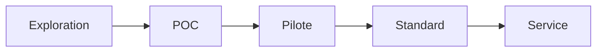

# Innovation Status

- Date de création: 2026-02-18
- Responsable: Équipe plateforme IA documentaire

## Statut actuel

- [ ] Exploration
- [x] POC
- [ ] Pilote
- [ ] Standard interne
- [ ] Service production

## Prochaine étape attendue

Passer en **Pilote** avec un corpus réel représentatif et des métriques de qualité suivies en continu.

## Critères de passage au niveau supérieur

### POC → Pilote
- corpus de validation de 50+ PDFs
- tableau de bord KPI extraction/précision
- procédure d’escalade incidents documentée

### Pilote → Standard
- SLO de disponibilité et de latence définis
- runbook exploitation validé
- stratégie de versioning des dépendances figée

## Risques identifiés

- dépendance à la qualité intrinsèque des PDFs
- régressions possibles lors de mises à jour Camelot/pandas
- limites sur PDF scannés sans OCR

