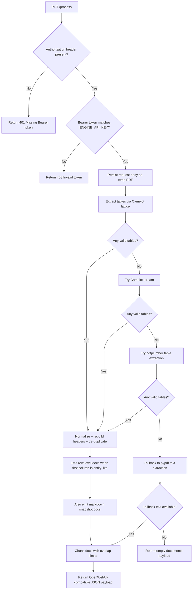
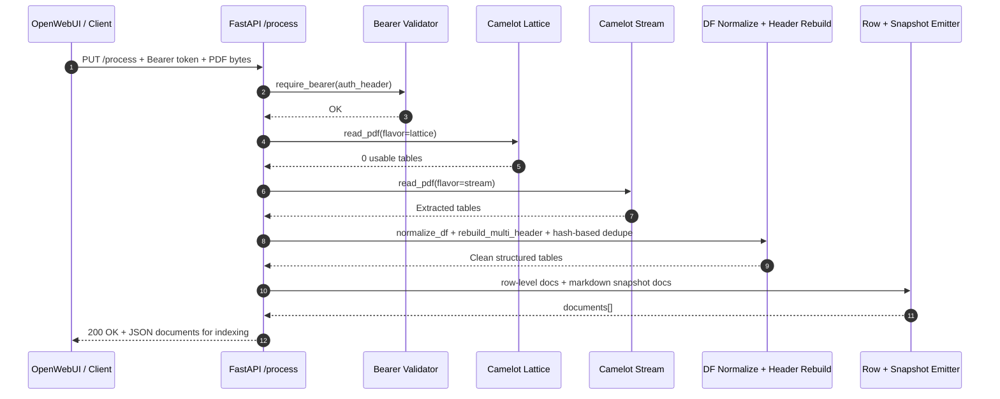
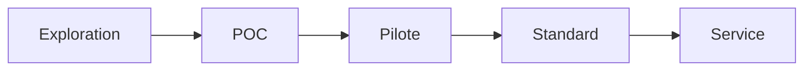

# Project State

This state file captures the ingestion engine control flow and one critical end-to-end test sequence.

## A) Router / Decision Flow

## B) Single Sequence for a Critical Test Case

### Critical case
**Authenticated upload of a table-heavy PDF where Camelot lattice fails but stream succeeds.**

## Notes

- The extraction strategy is intentionally **ordered** to prioritize structure quality before fallback text parsing.
- The critical case above validates the main reliability promise of the service: preserving table semantics even when one parser mode fails.

## C) Innovation Pipeline Traceability (Exploration → Service)

| Stage | Objective | Evidence to store | KPI examples |
| --- | --- | --- | --- |
| Exploration | Validate problem and feasibility | hypotheses, sample PDFs, target questions | baseline response quality |
| POC | Prove technical approach | extraction results, schema checks, quick benchmarks | parsing success rate |
| Pilote | Validate in near-real conditions | pilot dataset, incident log, user feedback | time saved per ingestion |
| Standard | Stabilize and document operation | runbook, controls, release notes | risk reduction (error rate) |
| Service | Operate with reliability targets | SLA/SLO, monitoring, ownership model | capacity created, cost avoided |
