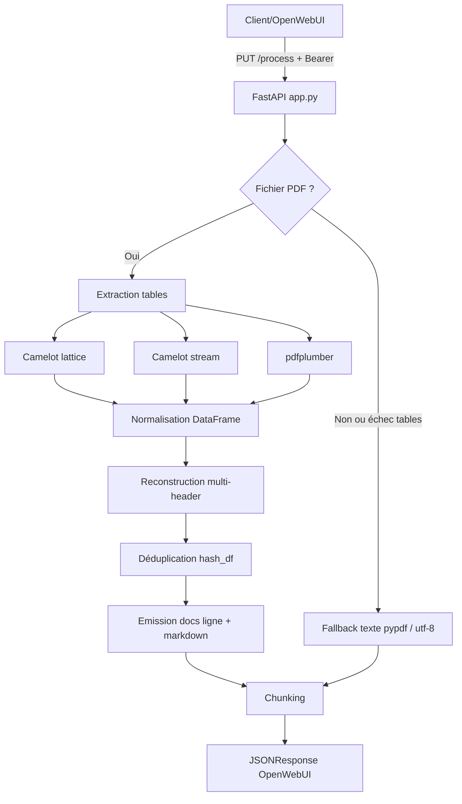

# Architecture

## Schéma global

## Composants

- **API layer**: FastAPI, endpoints `/health` et `/process`
- **Extraction layer**: Camelot, pdfplumber, pypdf
- **Transformation layer**: pandas (normalisation, entêtes, déduplication)
- **Emission layer**: génération des objets documents et chunking

## Déploiement minimal

- Un conteneur ou process Python
- Variables d’environnement pour clé API et paramètres d’extraction
- Exposition HTTP (port 8088 par défaut)
