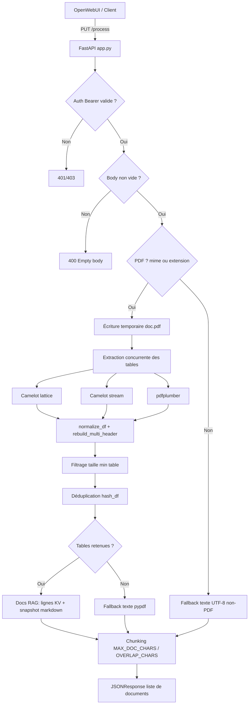

# Architecture

## Vue d’ensemble

`app.py` expose un service FastAPI d’ingestion de documents pour OpenWebUI via `PUT /process` avec authentification Bearer. Le moteur est optimisé pour les PDF tabulaires (Camelot + pdfplumber), puis retombe sur une extraction texte (`pypdf`) si aucune table exploitable n’est trouvée. Pour les non-PDF, il fait une extraction texte UTF-8 best effort.



## Composants

### 1) Couche API (FastAPI)

- **`GET /health`**: retourne `{"ok": true}`.
- **`PUT /process`**:
  - valide le token Bearer (`401` si absent/mal formé, `403` si invalide),
  - vérifie que le body n’est pas vide (`400` sinon),
  - route vers pipeline PDF ou non-PDF selon `Content-Type` / `X-Filename`.
- Réponse: toujours une **liste de documents** au format attendu par OpenWebUI (`page_content`, `metadata`).

### 2) Couche extraction PDF

Pipeline PDF en 3 extracteurs, exécutés en parallèle via `ThreadPoolExecutor`:

1. `camelot_lattice` (tables avec lignes explicites),
2. `camelot_stream` (tables textuelles),
3. `pdfplumber` (fallback table extraction).

Les résultats sont ensuite fusionnés dans un ordre stable (`page`, `source`, `hash`).

### 3) Couche transformation DataFrame

Appliquée sur chaque table:

- nettoyage des cellules/colonnes (`normalize_df`),
- reconstruction générique d’entêtes multi-lignes (`rebuild_multi_header`, jusqu’à `MAX_HEADER_ROWS`),
- re-nettoyage,
- filtrage qualité (minimum lignes/colonnes),
- hash stable (`hash_df`) pour supprimer les doublons inter-extracteurs.

Cette couche évite le hardcoding de schéma et améliore la robustesse multi-PDF.

### 4) Couche émission orientée RAG

Pour chaque table dédupliquée:

- **documents ligne-à-ligne (KV)** si la 1ère colonne est détectée comme colonne “entité” majoritairement textuelle,
- **snapshot markdown de table** systématique (fallback/contextualisation).

Chaque document trop long est chunké (`MAX_DOC_CHARS`, `OVERLAP_CHARS`) avec propagation des métadonnées de chunk.

### 5) Fallback texte

- **PDF sans table exploitable**: extraction texte `pypdf` page par page (limite `MAX_TEXT_PAGES`), puis chunking.
- **Non-PDF**: décodage UTF-8 best effort, puis chunking.

Les métadonnées incluent le moteur utilisé (`fallback_text` ou `basic_text`).

## Configuration (variables d’environnement)

### Obligatoire

- `ENGINE_API_KEY`: clé Bearer attendue; l’application échoue au démarrage si absente.

### Paramètres d’extraction/chunking

- `PDF_PAGES` (ex: `all`, `1-5`),
- `MAX_DOC_CHARS`, `OVERLAP_CHARS`, `MAX_TEXT_PAGES`,
- `MAX_HEADER_ROWS`,
- `CAMELOT_LATTICE_LINE_SCALE`,
- `CAMELOT_STREAM_EDGE_TOL`, `CAMELOT_STREAM_ROW_TOL`,
- `MIN_ROWS_FOR_TABLE`, `MIN_COLS_FOR_TABLE`,
- `EXTRACTOR_WORKERS`.

Ces paramètres pilotent finement qualité/coût/performance du pipeline.

## Contrat d’entrée/sortie

### Entrée attendue

- `PUT /process`
- Headers:
  - `Authorization: Bearer <ENGINE_API_KEY>`
  - `Content-Type: <mime>`
  - `X-Filename: <filename>` (optionnel)
- Body: bytes bruts du fichier.

### Sortie

Liste JSON de documents:

```json
[
  {
    "page_content": "...",
    "metadata": {
      "source": "...",
      "page": 1,
      "extractor": "camelot_stream",
      "table_id": "p001_t001_ab12cd34",
      "format": "row_kv"
    }
  }
]
```

Le service peut aussi renvoyer des métadonnées de chunk (`chunk`, `chunks_total`) selon la taille du contenu.

## Déploiement minimal

- Process Python + FastAPI (`uvicorn app:app --host 0.0.0.0 --port 8088`).
- Dépendances Python: `fastapi`, `uvicorn`, `pandas`, `pypdf`, `camelot-py[cv]`, `pdfplumber`, etc.
- Option système utile pour Camelot lattice: `ghostscript`.
- OpenWebUI configuré en mode `CONTENT_EXTRACTION_ENGINE=external` pointant vers ce service.
